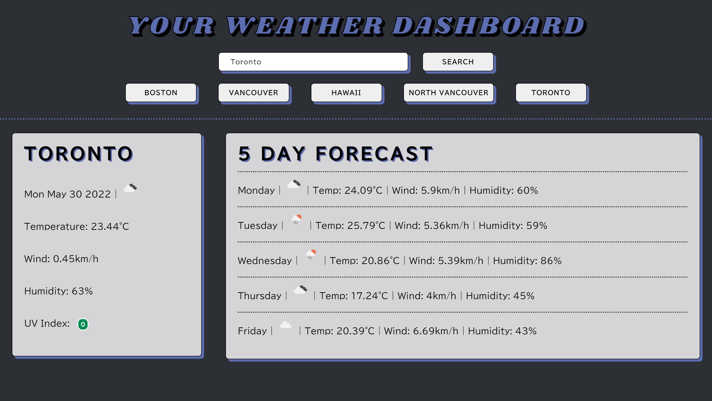

# Weather Dashboard

## Objective
The objective was to create a searchable weather dashboard using multiple API's to gather certain information and place it into the UI.

## Approach
My approach began with drawing out the UI to help ensure that the requirements would be met. I then wrote out my anticipated step by step process for the Javascript portion. This included researching Open Weather Map and the requirements needed to "fetch" the API. It was determined with a classmate that a geo location (geoapifty) API was also needed to get a city's latitude and longitude which is a requirement for the Open Weather Map API to function accordingly. Once this was all thought through, I began my coding journey.

## End Result

## Reflection
Following as much troubleshooting possible, I was unable to fully complete this project. The last missing piece is having the previously searched city buttons work on click. I realize that the way I coded is not sustainable long term and that is the downfall. I know in the future to create multiple functions that return something and then piece them all together. It's something I will work on but that being said, the UI is functional and looks great. It is still a goal for me to refine my code and use the philosopy of creating many small functions that work great. I did not meet this goal but on the other end, the code works. I'm proud of the work I put in.

## Final Product
[Click here to view](https://jessicamdittrich.github.io/CHG-JD053122)